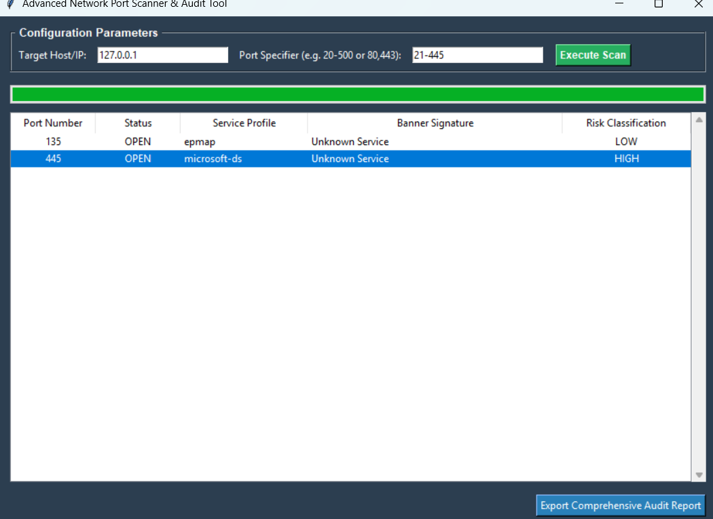
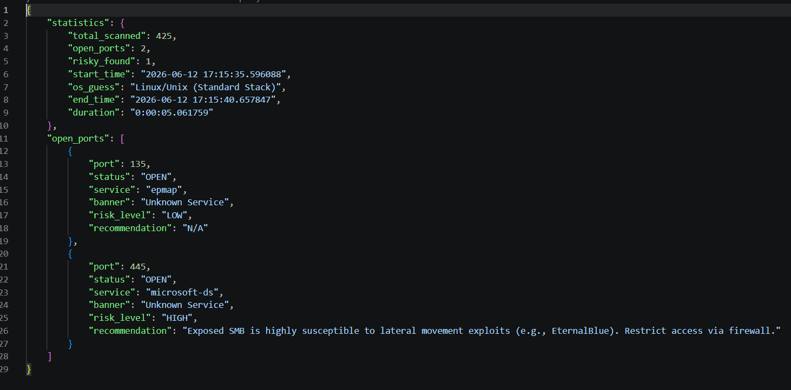

# Advanced Port Scanner (APS) & Compliance Auditor

A professional, modular, multi-threaded network discovery utility and security auditing engine written in Python. This tool allows network administrators and security researchers to scan host networks, identify active service banners, and automatically flag exposed legacy or high-risk protocols based on compliance risk frameworks.

## 🚀 Key Features

* **Multi-Threaded Architecture:** Utilizes Python's concurrent threading capabilities to sweep hundreds of ports simultaneously.
* **Service Banner Grabbing:** Interrogates open socket connections to extract software runtime banners for accurate asset profiling.
* **Automated Risk Assessment:** Automatically flags high-risk exposed protocols like Telnet (23), FTP (21), SMB (445), and RDP (3389) with recommended remediations.
* **Dual-Interface Operation:** Runs as a sleek, menu-driven Command Line Interface (CLI) or as a modern desktop application (GUI) built with Tkinter.
* **Structured Reporting:** Automatically exports audit logs into clean Text, CSV, or machine-parseable JSON formats.

---

## 🛠️ Project Architecture

The project follows industry-standard software engineering patterns with clean separation of concerns:

* **`core/scanner.py`**: Handles socket allocation, multi-threading queue loops, and host resolution.
* **`core/banner_grabber.py`**: Interrogates open ports to capture live service signatures.
* **`core/risk_analyzer.py`**: Compares discovered ports against known insecure protocols to generate risks.
* **`gui/app.py`**: Manages the Tkinter interface, asynchronous progress tracking, and user interactions.
* **`utils/`**: Houses utility classes for clean logging errors and multi-format file exporters.

---

## 💻 Installation & Setup

### 1. Prerequisites
Ensure you have Python 3.8 or higher installed on your system.

### 2. Clone and Navigate
```bash
git clone [https://github.com/your-username/Advanced-port-scanner.git](https://github.com/your-username/advanced-port-scanner.git)
cd advanced-port-scanner


Initialize Virtual Environment (Sandbox):

# On Windows
python -m venv venv
venv\Scripts\activate

# On Linux/macOS
python3 -m venv venv
source venv/bin/activate


Install Dependencies:

pip install -r requirements.txt

How to USE:

Mode A:

python main.py --gui

Mode B:

python main.py


📊 Sample Visual Metrics



